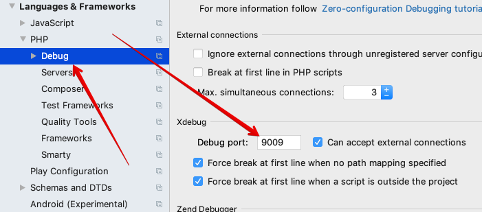
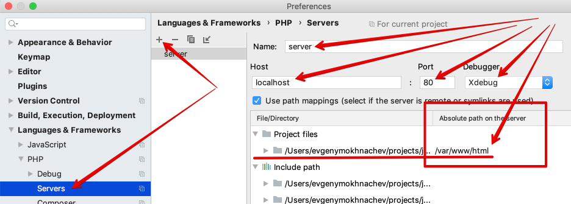

##How to config PHP debug
* Set configuration .env.
    * Copy `.env.example ` file and call it `.env` 
    * Set your local network IP like
        * `REMOTE_DEBUG_HOST=192.168.XXX.XXX` 
    * Set Xdebug port like
        * `REMOTE_DEBUG_PORT=9009` 
* Config PHPStorm
    *  In settings `Preferences | Languages & Frameworks | PHP | Debug` 
        * config debug port like `REMOTE_DEBUG_PORT` in `.env` file (`9009` default).
         
    *  In settings `Preferences | Languages & Frameworks | PHP | Servers`  
        * create server with name `server`.
    *  Set absolute path on the server
        * `/var/www/html`
    *  Set host
        * `localhost` 
    *  Set port
        * `80`
        
    *  Run listing debug connections 
